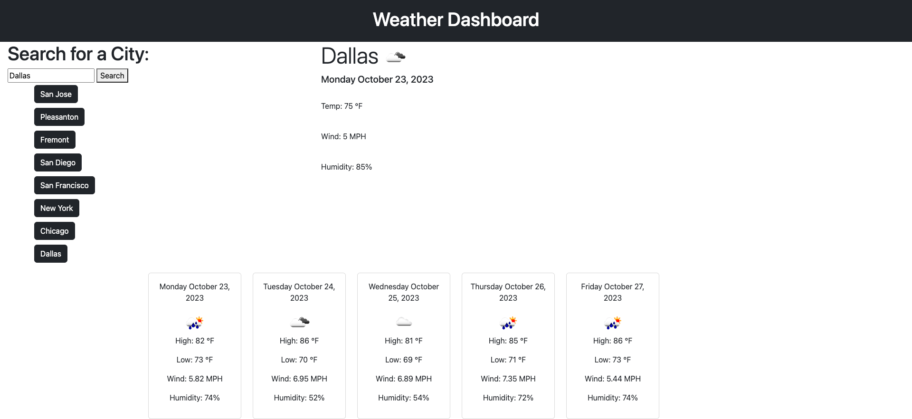

# Weather-Dashboard

## Description
This application is a Weather Dashboard which displays the current and five day forecast. It also saves the history of the last 8 cities you have looked up with easy button access. This application utilizes the [Open Weather Map API](https://openweathermap.org/).

## Screenshots

## Contributions
Vinita Navani
  
## Questions
For any questions please email me at vinita.navani@gmail.com or visit my Github page at [vini3076](https://github.com/vini3076).

## Links
[Github repository](https://vini3076.github.io/weather-dashboard/)

## Credits
 - Tutor: Aaron Centeno